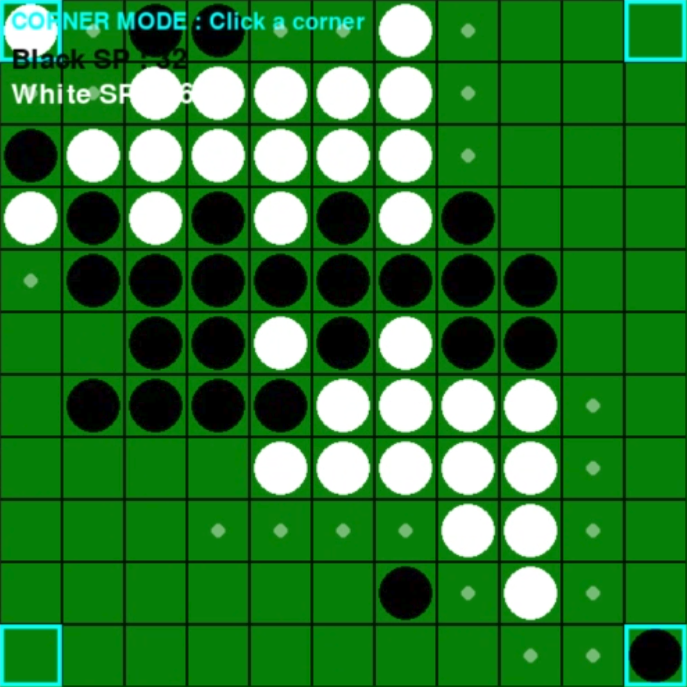

# オセロ

## 実行環境の必要条件
- python >= 3.10
- pygame >= 2.1

## ゲームの概要
- 通常のオセロに、盤面拡大・ランダム爆破・スキル機能などを追加した対戦型ボードゲーム。
- 参考URL：[【Pygame】オセロゲームを作成する方法](https://python.joho.info/pygame/pygame-othello/)

## ゲームの遊び方
- 黒と白の石を交互に置き、相手の石を挟むことで自分の石に変える。
- 最終的に盤面上の石が多いプレイヤーの勝利。
- スキルポイントを消費することで特殊スキルを使用できる。
- 終了条件：盤面がすべて埋まるか、両プレイヤーとも石を置ける場所がなくなったら終了する。石が多いプレイヤーの勝利。
- 操作方法：マスをクリックして石を置く。LキーでLock（3SP）、BキーでBomb（5SP）、CキーでCorner（8SP）を選択し、対象のマスをクリックして発動する。SPは一度に多くの石を取るほど多く溜まる。

## ゲームの実装
### 共通基本機能
- 描画
- 盤面の描画
- 石の描画
- 石を置ける場所の判定
- 石をひっくり返す処理
- ターン管理
- 勝敗判定

### 分担追加機能
- 盤面拡大機能(担当：nekomario28)：一定ターン経過後、盤面が8×8からランダムに拡大する。
- ランダム災害機能（担当：c0a2504494）：15ターン目以降、各ターン一定確率で盤面上の石を最大10個消去する。災害は最大2回発生する。
- スキルポイント(担当：c0a2525296)：一度に多くの石を取るほどスキルポイントが多く溜まる。
- スキル機能(担当：c0c25034)：スキルポイントを消費して、爆破・マスの一時無効化・角の取得などの特殊効果を発動できる。
- エフェクト機能（担当：c0a2514087）：石がひっくり返る際にGIFアニメーションを表示する。
- ガイド機能(担当：c0a2517694)：現在のプレイヤーが石を置ける場所を白い半透明の円で表示する機能。

### メモ
- EXPAND_START_TURN 何ターンめから盤面拡張を開始するかを設定可能
- random_boardsize_percentage 盤面が拡張される確率を設定可能
- turn_count変数　ターンをカウント
- expand_board関数　盤面を拡張
- ガイド機能：`guide()`で石を置けるマスを判定し、白い半透明の円を表示する。
- クラス設計：盤面の状態とゲームの各処理を`Othello`クラスにまとめている。
- load_gif_frames()は起動時に一度だけ実行され、GIFをPygame用の透過画像リストに変換する関数
- Effectは生成されたエフェクトの位置、表示するコマ、再生速度（表示時間）を管理・描画するクラス
- black_sp、white_sp　スキルポイントの変数
- update_locked -> 封印のターン数管理
- use_lock -> 封印　1ターンの間指定した位置に石を置けなくする。
- use_corner -> 角強制取得
- use_bomb -> 爆弾　3*3の範囲を自分の色にする。
- disaster -> 災害発生機能

### TODO
- 通信機能
- BGM
- 効果音
- 盤面を右・下だけでなく、上下左右へ均等に拡張する機能
- 終了ボタン・もう一度遊ぶボタン・強制終了時間削除
- 爆破・災害エフェクト
